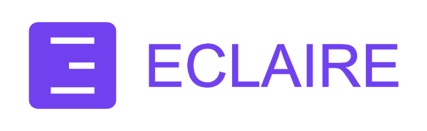

  

<h1 align="center" style="border: none; margin-bottom: 5;">Eclaire Labs — Privacy-Focused AI</h1>

  
  
  

### Hi there — we’re Eclaire Labs!
We love coding and building. We’re passionate about AI, open source, and keeping data private.

### 🚀 What we’re building
We’re building **Eclaire** — an open-source, local-first AI that organizes, answers, and automates across tasks, notes, documents, photos, bookmarks and more.

### 🔒 Why privacy matters
AI is becoming ubiquitous. Many products out there use user data to train and make decisions. We aim to provide an alternative for when tighter control over data is needed—private by design and under your control.

### 🤝 Work with us (business & partnerships)
If you’re exploring commercial use, we can help with:
- Custom domain-specific AI models  
- Private cloud deployment  
- Integrations & APIs  
- Onboarding, training, and dedicated support 

Contact us for a chat.

### 🛠️ Contributing
We welcome thoughtful features and bug fixes from privacy-minded builders. See repo for details or reach out to us.

---

**XXXXXX Labs Team**
